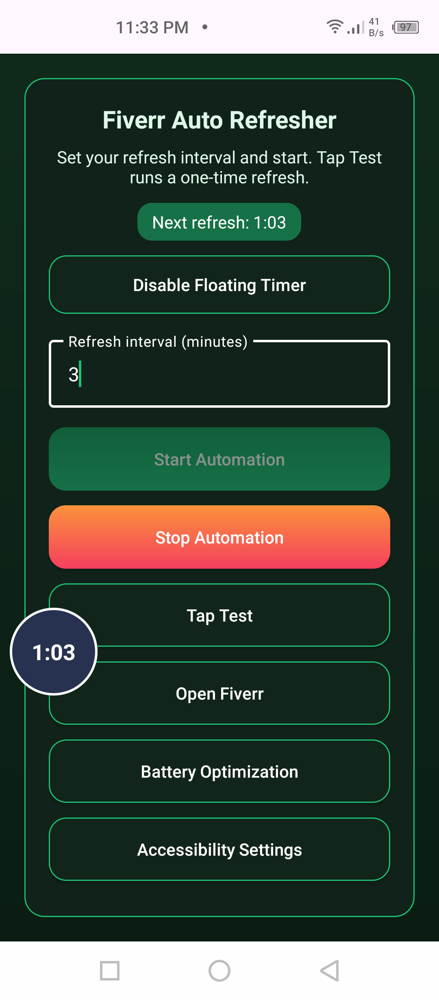
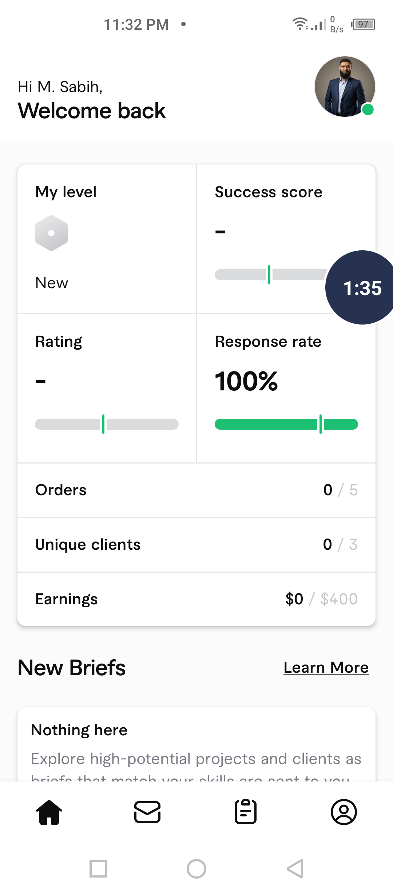

# Fiverr Auto Refresher

What you see above:
- Left: the in-app control panel where you set the refresh interval, start/stop automation, run a one-time Tap Test, and jump to Accessibility/Battery settings.
- Right: the floating timer bubble that appears while automation runs. It shows the live countdown, can be dragged anywhere (snaps to an edge), and tapping it brings the app back up.

Keep your Fiverr profile active with a lightweight, accessibility-driven auto refresher. The app opens Fiverr, waits, swipes down to refresh, and repeats on your chosen interval. A one-tap test flow lets you verify everything works before running it continuously.

## Why it’s useful
- Stays active: periodic refreshes help keep your Fiverr profile “online.”
- Hands-free: fully automated with start/stop controls and a one-time Tap Test.
- Safe by design: no root, uses Android Accessibility gestures only.
- Battery-aware: built-in prompt to ignore battery optimizations for stability.
- Foreground-smart: only reopens Fiverr if it isn’t already on top.

## Quick start (APK)
1. Copy `app/build/outputs/apk/release/app-release.apk` to your phone.
2. Allow installs from unknown sources for your installer (e.g., Files app).
3. If Play Protect warns, choose “Install anyway” or temporarily disable Play Protect during install.
4. Install the APK.

## First-time setup
1. Enable Accessibility Service:
   - Open app → tap “Accessibility Settings” → enable “Fiverr Auto Refresher.”
2. Whitelist battery optimization (recommended):
   - Tap “Battery Optimization” in the app and approve the request, or do it manually in system Battery settings.
3. (Optional) Pin the app in Recents if your OEM supports it to reduce background kills.

## Using the app
- Set interval (minutes): enter 1–60 in the box.
- Start: tap “Start Automation” (button disables while running). The app opens Fiverr, waits ~2.5s, swipes down, then repeats every X minutes.
- Stop: tap “Stop Automation” (re-enables Start).
- Tap Test: runs a one-time Fiverr open + refresh to verify setup.
- Accessibility needed? If the service is off, the app will take you to Accessibility Settings; enable it, then retry.
- Floating timer (optional): tap “Enable Floating Timer,” grant “Draw over other apps,” then start automation. A movable bubble shows the live countdown; drag to reposition (it snaps to an edge) and tap it anytime to reopen the app.

## Notes and tips
- If the service stops (reboot, power-saving), re-enable it in Accessibility.
- If Fiverr is already foreground, the app won’t relaunch it—just refreshes.
- For sideloading on other phones, use the signed release APK above; Play Protect may warn because it’s an accessibility automation tool.
- For ADB install: `adb install -r app/build/outputs/apk/release/app-release.apk`

## Building from source
- Debug APK: `GRADLE_USER_HOME=.gradle ./gradlew assembleDebug`
- Release APK (signed, shrunk): `GRADLE_USER_HOME=.gradle ./gradlew assembleRelease`

## Permissions
- Accessibility Service (required for gestures)
- Display over other apps (only if you enable the floating timer bubble)
- Request ignore battery optimizations (optional but recommended for stability)
